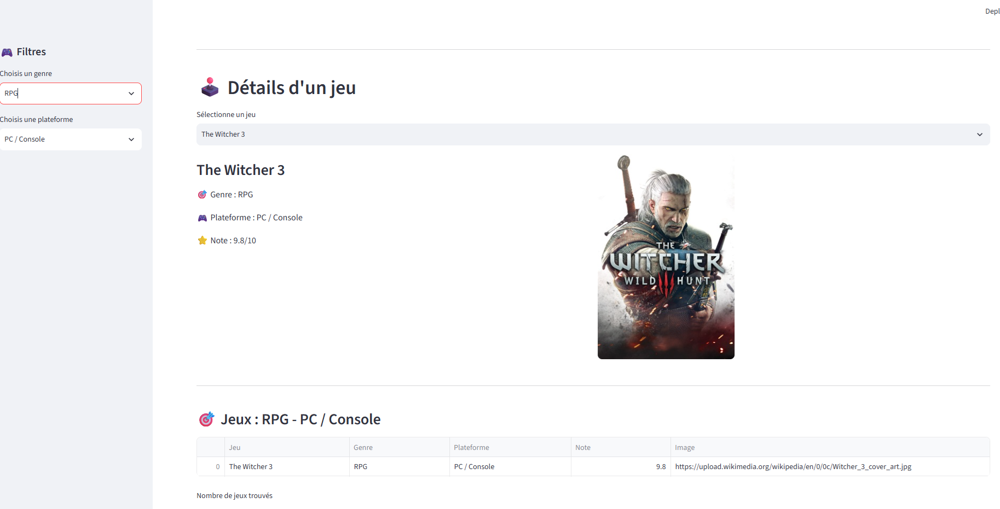

# 🎮 Gaming Explorer

Application Streamlit permettant d'explorer quelques jeux vidéo célèbres selon leur genre et leur plateforme.

## 📸 Aperçu de l'application

## 🚀 Fonctionnalités

- Sélection d'un genre de jeu
- Filtrage par plateforme
- Affichage des informations d'un jeu :
  - nom
  - genre
  - plateforme
  - note
  - image
- Tableau récapitulatif des jeux disponibles
- Graphique des notes moyennes par genre

## 🛠️ Technologies utilisées

- Python
- Streamlit
- Pandas

## 📂 Structure du projet
